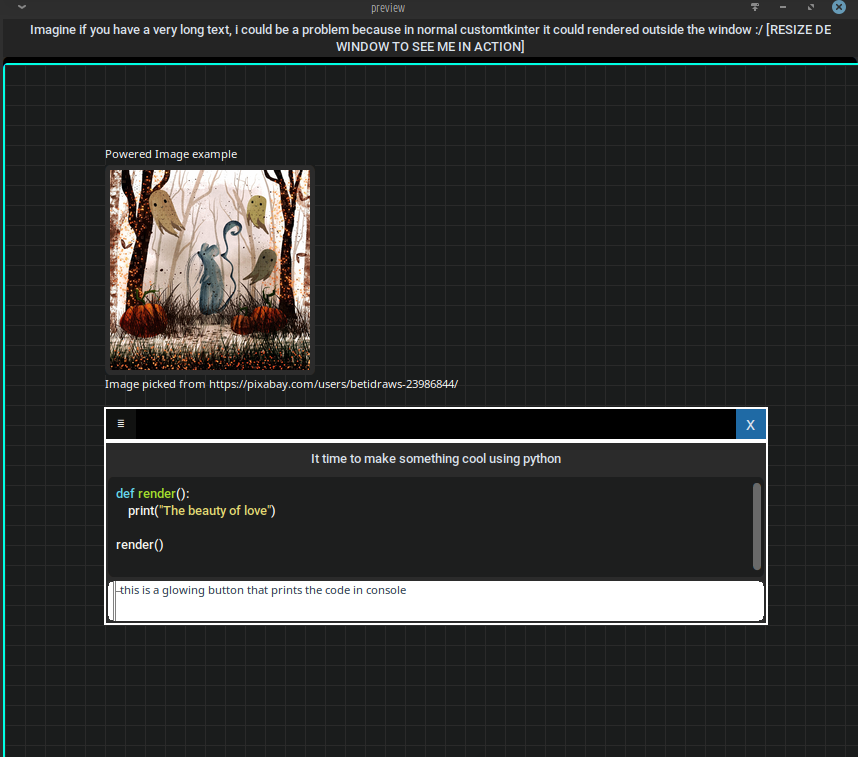

# CTKKomponents

This is an experimental list of CustomTkinter components that tries to make complex things.

## The components are actually in development
These components require a good hardware to run well, because Tkinter base of CustomTkinter is too slow rendering.

### This is a capture of the example

